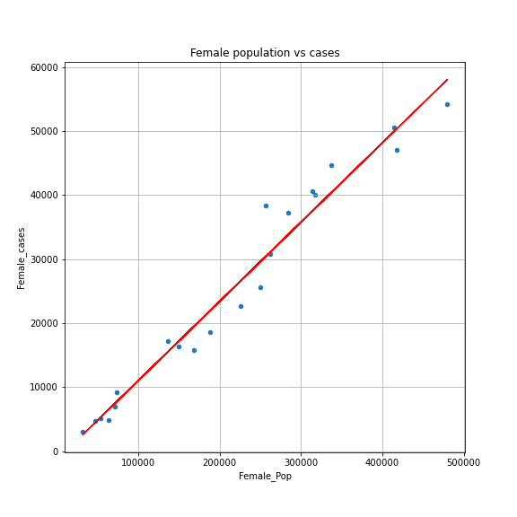

## Project Title: Analysis of # of Covid-19 Cases in NJ by County vs. Several Different Factors
* Name of Group: Pandemic Solvers
* Team Members: Dasa Simova, Joshua Pohl, Melissa Diep, Shuchi Khandelwal, Paul Shelffo

## Project Description/Outline
* Our team analyzed the # of Covid-19 cases in NJ by county, and the correlation that population size, # of hospitalizations, # of vaccinations, gender, age, and location has had on the # of cases per NJ county.

## Research Questions & Hypotheses
1. What is the correlation between population size and # of cases?
    - Hypothesis: positive correlation
2. What is the correlation between # of hospitalizations and # of cases?
    - Hypothesis: positive correlation
3. What is the correlation between # of vaccinations and # of cases?
    - Hypothesis: negative correlation
4. What is the correlation between gender and # of cases?
    - Hypothesis: gender does not affect likelihood of getting Covid
5. What is the correlation between age and # of cases?
    - Hypothesis: age affects likelihood of getting Covid
6. What effect does location have on the number of cases?
    - Hypothesis: The closer you are to a major city (e.g. NYC), the more cases there are. 

## Data Sources
1. CDC Data (June '21 data) - API
    - https://data.cdc.gov/resource/n8mc-b4w4.json?
    - Use: metrics for # of cases, # of hospitalizations by NJ county
2. USAfacts Data (7-15-21) - CSV
    - https://usafacts.org/visualizations/coronavirus-covid-19-spread-map/state/new-jersey
    - Use: cumulative # of Covid-19 cases by NJ county
3. Population Data (2019) - API
    - www.census.gov
    - Use: population data by NJ county
4. Vaccination Data - CSV
    - www.api.covidactnow.org
    - Use: metrics for vaccinations, new cases per day, cumulative cases by NJ county
5. New Jersey Counties Map 
    - https://njogis-newjersey.opendata.arcgis.com/datasets/county-boundaries-of-nj
    - Use: collect data via a Shapefile in order to visualize the groups of counties we are using. 

## Research Q1 - What is the correlation between pop. with # of cases?

### ***Data Sources & Cleaning up the Data***
#### 1. CDC Data (June '21 data) 
* To make the data size smaller, we filtered for June '21 as our sample for analysis. Per the API documentation provided, the new url became: https://data.cdc.gov/resource/n8mc-b4w4.json?res_state=NJ&case_month=2021-06&$limit=20000. 
#### 2. USAfacts Data (7-15-21) 
* We wanted to further prove any hypothesis made with population vs June 21 cases by comparing population to the total cumulative cases by NJ county. 
* We found the total cumulative cases for all states as of 7-15-21 in CSV format from USAfacts.
* We cleaned the data by filtering for just NJ cases, and dropped all fields except for the County name, County_Num, and cases as of 7-15-21. Most of the other columns represented # of cases as of a different date.
#### 3. Population Data (2019) 
* We sourced Census API which includes the total population size by county as of 2019. This was the most up to date free data available.
* In preparation for future merging of the data, we formatted the data so that the necessary fields matched the same taxonomy of the CDC Data (example: County, County_Num).

### ***Merging the Data & Visualizations***
* We merged our CDC + USAfacts + Population data, and created a panda dataframe visualization in descending order from largest to smallest population size.
        
* We outputted linear regression and bar graph visualizations to show correlation between:

  ##### A. Population (2019) vs Cases (June 2021)

   ##### B. Population (2019) vs Cumulative Cases (as of 7-15-21)

   
   

### ***Conclusions for Research Q1***
* Bar graphs and linear regressions support that there is strong correlation between population size and cases.
   * We can see from the bar graphs and consolidated panda dataframe that the most populated counties generally have the most # of cases. One thing to note that it is a unexpected that Monmouth  has the most # of June cases when a few counties have larger population size. We believe that this may be attributed to timing of each county's collection of the cases data. Perhaps not all cases/hospitalizations are reflected yet in this data. 
   * Linear regression shows a strong positive correlation between population size and cases with an r-squared > 0.90. 

## Research Q2 - What is the correlation between hosp. with # of cases?

### ***Data Sources & Cleaning up the Data***
#### CDC Data (June '21 data) 
* To make the data size smaller, we filtered for June '21 as our sample for analysis. Per the API documentation provided, the new url became: https://data.cdc.gov/resource/n8mc-b4w4.json?res_state=NJ&case_month=2021-06&$limit=20000. 
* We also dropped fields that were unrelated to the hospitalization vs cases research question. 
* Next, we filtered the hospitalizations field for "Yes". 

### ***Visualizations***
* We outputted linear regression and bar graph visualizations to show correlation between hospitalizations vs cases (June 2021)

### ***Conclusions for Research Q2***
* Bar graphs and linear regressions support that there is a moderate correlation between hospitalizations and cases
   - We can see from the bar graph and consolidated panda dataframe that counties with the fewest # of cases have the lowest # of hospitalizations (i.e. Salem), however it is a bit unexpected that Passaic has one of the most # of hospitalizations at 63, since 5 other counties had more # of cases. Other factors must have contributed to Passaic's high # of hospitalizations. It is also unexpected that Monmouth which has the most # of June cases has relatively low # of hospitalizations. This may be attributed to timing of each county's collection of the cases/hospitalizations data. Perhaps not all cases/hospitalizations are reflected yet in this data. 
   - Also, the linear regression shows a moderate correlation with an r-squared of 0.67. Passaic/Monmouth can also be seen as an outliers in this visualization, as their points are the most out of alignment with the line plot. 

## Research Question 3 - What is the correlation between # of vaccinations with # of cases?

### ***Data Sources & Cleaning the Data***
*  We sourced the vaccination data in csv format from www.api.covidactnow.org, in time series for each county. The full dataset consists of 11319 entries, for 21 counties, for 2020 and 2021 per day. After we collected the data, we dropped the data not related to the vaccination and the number of cases and also the rows which didn't provide data in the selected fields (NaN values). Final dataset has 2892 entries(rows). Further analyses were performed with the data about actual vaccination initiated, actual vaccination completed, actual new cases, and data pertaining to the identification of the county, and the day when the data was collected. 
* The term vaccination completed refers to the number of individuals who have received a single dose from a one-dose vaccine course,  or their second dose from a two-dose vaccine course; vaccination initiated refers to the number of individuals who have received only one dose from a two-dose vaccine course. 
* The vaccination time series data was used to showcase vaccination by date and  actual new cases by date by county in NJ. For the county with population vaccinated at the highest rate (Morris County) and at the lowest rate (Cumberland County) bar graph was selected to provide an outlook at the vaccination data vs actual new cases data.

### ***Merged Data & Other Visualizations***
* We merged vaccination data with population data and created a stacked bar graph to showcase the  percentage of population vaccination initiated and vaccination completed, with markers used to point the actual total cases in % of population by county,NJ.  
 
* We built a series of linear regression graphs by county in NJ. Our hypothesis assumes that there is a negative linear relationship - when vaccinations increase, the number of cases decreases. To show possible relationship between vaccination and the number of the cases of COVID two counties were chosen based on percentage of vaccinated people of total population in the county (results as in June 2021). 

 Linear regression was used for total vaccinaction vs total vaccination. However, based the results, a different function should be used to explain the correlation and trend in this case better. 

1. The county with the highest percentage of vaccinated people - Morris County (67% vaccination initiated, 61% completed, 10% cases of total population). Linear regression and Pearson's correlation coeffient showcases strong linear relationship by the value of r, 0.867 and coefficient 0.98. However, the number of cases is flat starting at some point, and if it continues in that direction - it means, statistically, that even if we increase the number of the vaccinated people , the number of cases will not increase.

    

2. The county with the least percentage of vaccinated people - Cumberland County (47% vaccination initiated, 39% vaccination completed and 11.5% cases of total population). Linear regression and Pearson's coefficient showcases a stronger positive linear relationship ( r value is 0.97 and coefficient has value 0.99) than Morris County.  We can also notice the flattening in the data.     

Linear regression was then used for vaccination and daily new cases to display the relationship.  

Morris County

 

### ***Conclusions for Research Q3***
* Research Q3 - Based on plots and line equations, with correlation coefficients calculated we can say there was a positive linear correlation between vaccination and the total number of cases. However, the eventual flattening of the linear regression visualizations and the stronger linear relationships for the least vaccinated (Cumberland) vs most vaccinated (Morris) county may indicate that more vaccinations do result in fewer cases over time. However, we should consider broader analysis and functions in this scenario to correctly observe and predict future scenarios. 

In linear regression where the total number of vaccinated people vs number of daily cases is in relation for the plot, there is a correlation between these two variables. With more vaccinated people the number of cases decreases, and the negative linear relationship in our hypothesis was confirmed. For all counties in NJ the vaccination had impact to lower the daily number of cases, with prediction to stay in negative linear correlation.  

## Research Question 4 & 5 -  
### * Question 4:  What is the correlation between gender and # of cases?
### * Question 5: What is the correlation between age and # of cases?

### Data Sources & Cleaning the Data
####  1. CDC Data API (Cases Categorized by NJ, Gender, and Age-groups)
* We pulled data from the CDC API and filtered the API URL so we only received New Jersey information. The API showed individual Covid-19 cases that included categories like county, gender, age group, ethnicity, and hospitalization, then we filtered the data down to only show county, gender, and age group, along with the numerical code corresponding to each county. We did not include cases that didn’t identify the gender or age group of the afflicted individual. To get the largest amount of data we could set the limit on the API to 1.1 million because this is a little over the total number of Covid cases in New Jersey shown on the USAFacts website (https://usafacts.org/visualizations/coronavirus-covid-19-spread-map/state/new-jersey).
* To clean the data we had to match the column names and format the county code column to have the complete county and state code to match the code given by the 
####  2. Census API (Total Population, Gender & Age-group Population)
* We pulled data created by the census bureau using the Census API and filtered the data to show the total population by county for New Jersey
* We also pulled data from another Census API that contained population data for gender and several age groups of each county in New Jersey.
* To clean the data to match the categories in the CDC Data we had to get rid of unwanted age groups and combined others to get the population of people between 18 and 49 and 50 to 64 in each county. We also had to format the county code column to have the complete county and do a count() function to get the total number of cases with age and gender information for each county by age and by gender.

### ***Merged Data & Other Visualizations***
* We merged CDC Data with the Census data to show us the total populations per county by age group and gender next to the number of cases per county by age and gender.
* We took this data frame and found the percentage of cases to the population for each county
#### Cases as a percentage of gender population

#### Cases as a percentage of age group population

* We took the first merged data frame and summed all of the rows for each column so we could have cases and populations for New Jersey that had specified the information we desired as a whole.
#### Cases as a percentage of total NJ gender population

#### Cases as a percentage of total NJ age group population

* While looking into a linear regression with gender/age cases to the population we saw a similar trend that we did in question one where case numbers and population have a high correlation.

### ***Conclusions for Research Q4***
* From our analysis of gender cases and population, we can see there is a very slight difference in the percentage of female cases to male cases where females have 0.13% more covid-19 cases. Since we compared female/male cases to the female/male population of counties in New Jersey the correlation between gender and Covid cases followed the trend shown in the total population vs total cases analysis where a higher concentration of either gender shows a higher number of cases for both genders. 
* It is interesting to point out that all New Jerseys counties except for Cumberland County have a higher population of females than males. Although all but one county has a higher population of females, 10 out of the 21 counties had more male cases than female cases. 
* The findings from cases categorized by gender did fit the hypothesis of gender not having an influence on an individual contracting Covid-19 because it is more a matter of chance and the total population in an area. 

### ***Conclusions for Research Q5***
* Based on the analysis of age group cases to the respective population we discovered that people between the ages of 18 and 49 have a higher percentage of Covid-19 cases followed by people 50 to 64, 65 and over, and under 18, respectively. Although this was the case for New Jersey as a whole and most counties, this was not the case for Hudson County where people 50 to 64 had a higher percentage of cases. We also found that in Hunterdon County and Sussex County, people under 18 had a higher percentage of cases than people 65 and older but were still behind the cases in the 18 to 49 and 50 to 64 age groups. 
* From the analysis, we were able to think of possible reasons as to why the cases numbers came out the way they did. For instance, people between 18 and 49 and 50 to 64 could have a higher percentage of cases because they are actively in the workforce (out of high school but not retired) and while there are people who can work remotely there are also people that cannot and have to be in contact with people daily. The reasoning of having to be around people daily can also explain why people 65 and older are more likely to contract Covid than people under 18 because people 65 and older could be in assisted living homes or in contact with people who help them daily. While doing a linear regression of the age group cases to the population we found that it also follows the trend found in question one where a higher population for any age group correlates in a higher number of cases.

## Research Question 6 -
###  What effect does location have on the number of cases?

### ***Data Sources & Cleaning the Data***
####  1. USA Facts CSV (Populations Categorized by County)
* In order to understand how populated NJ was, we took information from the census and broke down the population based on county. From there, we separated the populations into two areas: Area 1 & Area 2. Area 1 encompases the counties that are closest to NYC: Bergen, Passaic, Hudson, Essex, Union, Middlesex, & Monmouth. Area 2 is the rest of the state. 

####  2. CDC Data API (Cases Categorized by County)
* In order to See if location had an effect on the number of cases, we grouped the number of cases in each county using the same groups we did with the population data. We pulled the data out, separated it by state and then county in order to get what we needed. We then compared the number of cases in each area to the number of people in each area. 

### ***Merged Data & Visualizations***

#### Map Visual Depicting Separate Areas 

#### Percentage of population in each area 

#### Percentage of cases in each area 

### ***Conclusions for Research Q6***

* Based on these two Pie charts we can see that Area 1, while a much smaller portion of NJ, has many more people in a smaller area. Approximately 1,000,000 more people in that area. While the second are is much more spread out. If we look at the percentage of cases in both areas we can see that most of the cases were in Area 1, despite the fact that it was a much smaller area.
* Area 1 is likely more crowded due to the fact that it is so close to NYC, which is where people in those areas would commute to. Therefore, we can argue that as we move away from major hub cities, such as NYC in this case, we see fewer cases. However, the fact that we're seeing fewer cases in these areas may not just be limited to the fact that they're further away from NYC. It could also have to do with the fact that there are more people living in these counties. Just the fact that there are so many more people in Area 1 than Area 2 is compelling in explaining why NJ may have had so many cases. Having so many people in one area going back and forth to an even more corwed and populated area simply increases the chances of exposure, which increases the chances of contracting the virus. 
